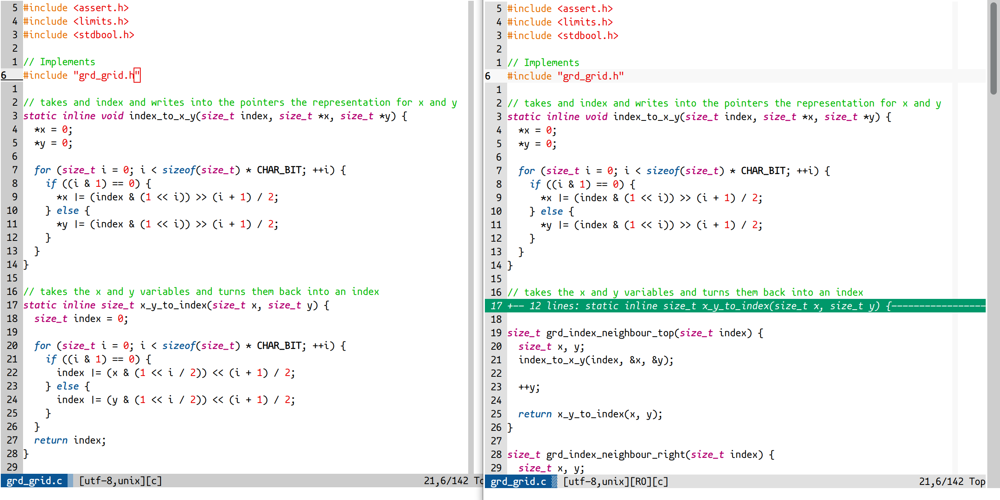

# vim-colors-bionik
A light vim colorscheme with green comments and familiar keyword colors.

MacVim on the left; iTerm on the right with correct ANSI colors.

## Goals
* light colorscheme
* green comments
* familiar keyword colors 
    - similar to Xcode, light visual studio 2010
* uses italic, bold and underlined in the terminal
* terminal support
    - use the in the terminal defined (16) ANSI colors
    - provide a good experience on a variety of selected colors
* GUI support
    - always uses the correct colors (see screenshot above)

## Recommendations
### Font
Use a font with real italic letters like
* [Mononoki](http://madmalik.github.io/mononoki/)
* Consolas
* [Fantasque Mono](https://github.com/belluzj/fantasque-sans)
* [Inconsolata LGC](https://github.com/MihailJP/Inconsolata-LGC)

### Terminal Colors

Use for the background white `#ffffff` and for the foreground black `#000000`

| ANSI Code | Color                     | used by the colorscheme |
|-----------|---------------------------|-------------------------|
| 0         | Black: `#000000`          | no                      |
| 1         | Red: `#e60000`            | yes                     |
| 2         | Green: `#00b800`          | yes                     |
| 3         | Yellow: `#e66e00`         | yes                     |
| 4         | Blue: `#0a5594`           | yes                     |
| 5         | Magenta: `#b30070`        | yes                     |
| 6         | Cyan: `#00986a`           | yes                     |
| 7         | White: `#cccccc`          | yes                     |
| 8         | Bright Black: `#7f7f7f`   | no                      |
| 9         | Bright Red: `#ff3236`     | no                      |
| 10        | Bright Green: `#34ee34`   | no                      |
| 11        | Bright Yellow: `#ffa552`  | yes                     |
| 12        | Bright Blue: `#428ecf`    | yes                     |
| 13        | Bright Magenta: `#ec4fb1` | no                      |
| 14        | Bright Cyan: `#42d0a5`    | yes                     |
| 15        | Bright White: `#ededed`   | yes                     |

## FAQ
* [Italic in iTerm.app and tmux](https://medium.com/@dubistkomisch/how-to-actually-get-italics-and-true-colour-to-work-in-iterm-tmux-vim-9ebe55ebc2be): Without the "Configure vim" chapter;  `set termguicolors` has nothing to do with the italics.
